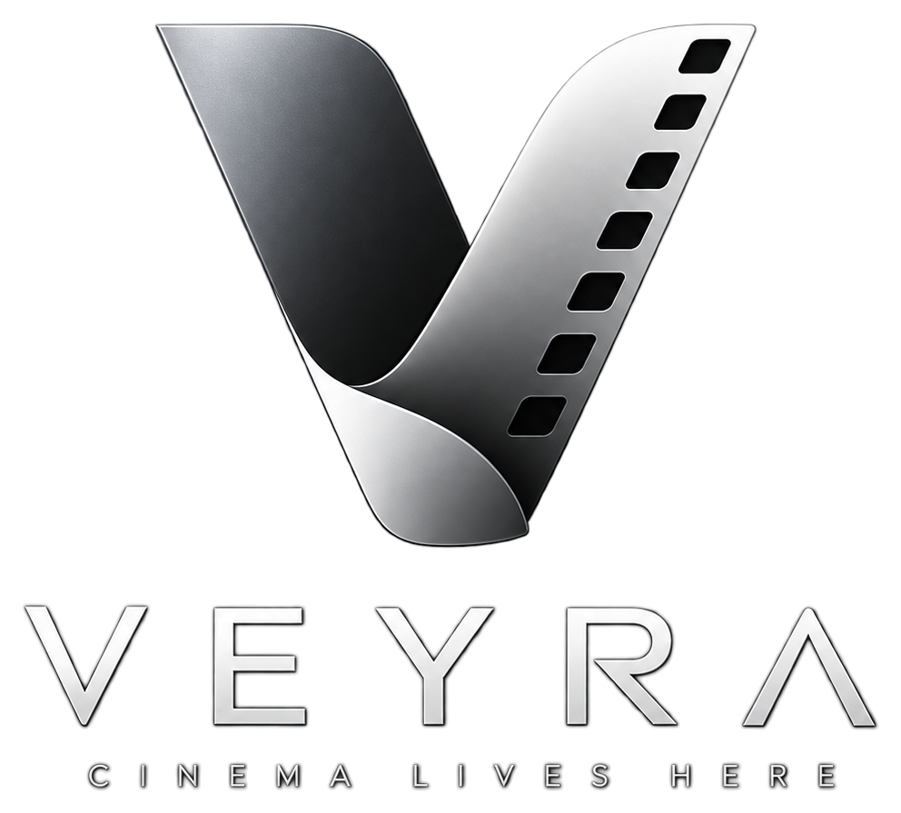

<div align="center">



# V E Y R A
### *Cinema Lives Here.*

**An artisanal, editorial-grade streaming platform engineered for cinephiles.**<br/>
Bespoke dual-palette aesthetics, tactile spring-inertia decision cards, 7-server failover engine, live subtitle timing calibration, personal Cinema Wrapped analytics, and local-first progress synchronization.

---

[](https://nextjs.org/)
[](https://react.dev/)
[](https://www.typescriptlang.org/)
[](https://tailwindcss.com/)
[](https://supabase.com/)
[](https://groq.com/)
[](https://upstash.com/)
[](https://resend.com/)

[Live Demo](#-quick-start) • [Architecture](#-system-architecture) • [Design System](#-bespoke-design-system) • [Feature Matrix](#-flagship-features) • [Deployment](#-production-deployment)

</div>

---

## 📽️ The Veyra Philosophy

Most modern streaming interfaces are either bloated corporate SaaS dashboards covered in autoplay ads or poorly assembled clone scripts with neon drop-shadows and broken player embeds.

**Veyra was built from scratch to honor the craft of filmmaking.**
- **Criterion-Grade Editorial Hierarchy**: Palantir-level restraint meets Apple simplicity. Content is king; UI elements gracefully retreat into the ambient darkness.
- **Truth In Presentation**: No fake viewer counters, no synthetic "Alex is watching" activity bots, and no false promises of synchronized cross-origin iframes. What you see is authentic, verified data.
- **Privacy First, Offline Resilient**: Watch progress and preferences sync to Supabase with PostgreSQL Row-Level Security (RLS) for authenticated members, while guests enjoy full `localStorage` progress caching and zero-lockout settings.

---

## 🌟 Flagship Features

```
                                  VEYRA CORE PLATFORM
  ┌───────────────────────┬────────────────────────┬────────────────────────┐
  │   🎬 STREAMING CORE   │    🧠 AI DISCOVERY     │   📊 CINEPHILE TOOLS   │
  ├───────────────────────┼────────────────────────┼────────────────────────┤
  │ • 7-Server Failover   │ • Groq Llama 3.3-70B   │ • Cinema Wrapped Stats │
  │ • Beacon Progress Sync│ • Natural Vibe Search  │ • 1-Click Canvas PNG   │
  │ • Keyboard HUD Overlay│ • Spoiler-Free Recaps  │ • Letterboxd CSV/RSS   │
  │ • Precision Sub Sync  │ • Live Movie X-Ray     │ • Curated Collections  │
  │ • Auto-Next & AirPlay │ • Decider Motion Deck  │ • Cinema Lounge Chat   │
  └───────────────────────┴────────────────────────┴────────────────────────┘
```

### 1. 🎛️ Pro Cinema Video Player & HUD
- **7-Tier Multi-Server Failover Engine**: Instant hot-swapping between **VidKing** (Primary · Cloud Sync), **AutoEmbed** (Direct 1080p), **VidLink** (Ultra HD), **2Embed** (Direct Stream), **VidSrc PM** (Fast Edge), **VidSrc Pro** (Multi-Mirror), and **Smashy** (Backup). If any mirror stalls for >10s, an intelligent failover pill prompts a 1-click fallback switch.
- **Cinema Keyboard HUD with Floating Tooltips**: An ambient HUD overlay that responds to natural cinema hotkeys (`Space`, `←`/`→`, `F`, `M`, `S`, `C`, `[ / ]`, `?`) and features an interactive tooltip dock that surfaces on cursor hover.
- **Precision Subtitle Engine with Live Timing Calibration**:
  - Auto-scrapes clean subtitle streams across 30+ languages with zero user file uploads.
  - **Live Keyboard Nudging**: Press `[` to delay or `]` to advance subtitles by `0.1s` during playback without pausing.
  - **Scrubbing Slider & Presets**: Dedicated buttons for `-1.0s`, `-0.5s`, `-0.1s`, `Reset`, `+0.1s`, `+0.5s`, `+1.0s` and range slider (-10.0s to +10.0s) saved automatically in `localStorage`.
- **Fault-Tolerant Watch Progress**:
  - Authenticated sessions flush progress via `navigator.sendBeacon` and `visibilitychange` listeners to prevent lost timestamps on rapid tab closures.
  - Guest sessions persist progress under `veyra_progress_${type}_${id}` in `localStorage` and resume automatically on reload.

### 2. 🃏 The Decider — Kinetic Cinema Discovery
- **Tinder-Style Decision Engine**: Can't agree on what to watch? Launch **The Decider**.
- **Tactile Motion Physics**: Built on Framer Motion (`motion/react`) with spring inertia (`stiffness: 320, damping: 26`) and velocity carryover. Releasing below threshold springs naturally back to center; swiping past 90px carries velocity off-screen.
- **Hardware-Accurate Feedback**: Responsive touch protection (`touch-none` prevents mobile pull-to-refresh conflicts), keyboard arrows (`← Not for me`, `→ Loved it`, `Space Skip`), and perfect-pick algorithm reveal.

### 3. 📊 Cinema Wrapped & Personal Analytics (`/stats`)
- **Live Watch Metrics**: Real-time aggregation of total minutes/hours streamed, completed films, and binge-watched episodes.
- **Taste Profile Visualizations**: Interactive top genre breakdown, decade distribution bar charts, and TV vs. Film ratio odometer.
- **1-Click High-Res PNG Share Card**: Generates an editorial 1240×680 graphic using HTML5 Canvas with an 8-poster ribbon collage, user stats, and authentic brand typography ready for social sharing.

### 4. 📥 Letterboxd Ecosystem Importer (`/import`)
- **Dual-Engine Ingestion**:
  - **CSV File Upload**: Drag-and-drop parser for Letterboxd `watched.csv`, `diary.csv`, or `watchlist.csv` exports with UTF-8 BOM stripping, comma-in-title sanitization, and release-year disambiguation.
  - **Live RSS Scraper**: Fetch public Letterboxd profiles via username with automated pagination.
- **Batch Resolution**: Idempotently upserts imported titles into your Supabase watchlist or private collection without creating duplicate entries.

### 5. 🤖 Groq-Powered Cinema AI
- **Natural Language Vibe Search**: Query movies by hyper-specific aesthetic moods (*"A rainy, neon-lit neo-noir set in 90s Taipei"*).
- **Episode Catch-Up & Recap**: 100% spoiler-free summaries synthesizing the story so far before diving into a new season.
- **In-Stream Movie X-Ray**: Instant access to cast filmographies, behind-the-scenes trivia, and historical context.
- **Hardened Architecture**: Capped with Zod input length constraints, IP rate limiting (10 req/min), and automatic fallback to curated editorial collections if LLM APIs experience rate exhaustion.

### 6. 🛋️ Cinema Lounge & Live Chat (`/party`)
- **Truthful Virtual Screenings**: Clear transparency that third-party video embeds run locally while room metadata, real-time message chat, presence counters, and interactive floating emoji reactions synchronize live across peers.

---

## 🎨 Bespoke Design System

Veyra abandons generic flat design and harsh neon glows in favor of a handcrafted, tactile theater atmosphere.

```
                  5-LAYER ATMOSPHERIC CINEMA STAGE
 ┌─────────────────────────────────────────────────────────────┐
 │ 1. PROJECTION BEAM      Warm radial 35mm amber/rose beam    │
 │ 2. NEBULA LIGHT PODS    Deep atmospheric indigo & plum pools│
 │ 3. CINEMA TILE MOTIF    Handcrafted film strips & monograms │
 │ 4. 35MM ORGANIC GRAIN   Monochrome film noise (anti-banding)│
 │ 5. VIGNETTE PERIMETER   Soft edge focus funneling viewport  │
 └─────────────────────────────────────────────────────────────┘
```

### Dual-Palette Color Tokens

| Semantic Token | Obsidian Dark Mode (🌙 Default) | Sakura Light Mode (🌸 Editorial) |
|:---|:---|:---|
| **Canvas Background** | `#0A0A0A` (Deep Matte Obsidian) | `#FDF4F6` (Pastel Blush) |
| **Card Surface** | `#141414` (Cinema Charcoal) | `#FFFFFF` (Pure Porcelain) |
| **Surface Accent** | `#1E1E1E` (Dark Slate) | `#F6E3E9` (Soft Rosé) |
| **Borders & Dividers** | `#2A2A2A` (Hairline Smoke) | `#E8BFCC` (Delicate Rose Gold) |
| **Primary Brand Accent** | `#EF7B44` (35mm Film Warm Amber) | `#D96A8A` (Cherry Blossom Pink) |
| **Primary Typography** | `#FFFFFF` (Crisp Studio White) | `#231217` (High Contrast Espresso, 16:1) |
| **Muted Typography** | `#707070` (Subtle Silver) | `#7A505E` (Warm Mauve, 5.1:1 AA) |

* **Zero-FOUC Guarantee**: Built-in `<head>` execution script reads `localStorage.getItem('veyra_theme')` before layout paint, preventing white flashbangs on reload.
* **Universal Cinema-Dark Guardrail**: Video player containers and HUDs stay locked in high-contrast cinema dark mode regardless of global theme switches.

---

## ⌨️ Cinema Keyboard Shortcuts

Control playback without ever reaching for your mouse:

| Key | Action | HUD Feedback |
|:---:|:---|:---:|
| <kbd>Space</kbd> | Toggle Play / Pause | Toast badge with play/pause state |
| <kbd>→</kbd> | Jump Forward 10 seconds | Toast badge `+10s` |
| <kbd>←</kbd> | Jump Backward 10 seconds | Toast badge `-10s` |
| <kbd>F</kbd> | Toggle Fullscreen | Instant viewport scale |
| <kbd>M</kbd> | Toggle Audio Mute / Unmute | Toast badge with mute state |
| <kbd>S</kbd> | Cycle Stream Server | Switches active mirror (1–7) |
| <kbd>C</kbd> | Open Subtitles & Audio Timing Drawer | Slides CC modal overlay |
| <kbd>[</kbd> | Delay Subtitle Timing by `-0.1s` | Instant live sync offset nudge |
| <kbd>]</kbd> | Advance Subtitle Timing by `+0.1s` | Instant live sync offset nudge |
| <kbd>?</kbd> | Open Keyboard Shortcuts Cheat Sheet | Modal with all shortcut mappings |

---

## 🔒 Security & Enterprise Architecture

- **PostgreSQL Row-Level Security (RLS)**: Enforced across all 8 Supabase tables. Users can only query, modify, or delete their own data.
  - `user_preferences`: Strictly isolated via `auth.uid() = user_id`, keeping settings private while keeping profiles public.
  - `watchlist`, `watch_progress`, `reviews`: Scoped to tenant ID.
  - `collections`: Owner-restricted write with public/private discovery visibility.
- **Distributed Rate Limiting**: Upstash Redis sliding window limiters protect against credential brute-forcing (5 attempts/min on auth) and API exhaustion (20 requests/10s on AI/stats).
- **Bot Mitigation**: Cloudflare Turnstile verification guards all signup, login, and password reset forms.
- **Strict Server Scoping**: `SUPABASE_SERVICE_ROLE_KEY`, `GROQ_API_KEY`, `TMDB_API_KEY`, and `UPSTASH_REDIS_REST_TOKEN` are completely isolated to server routes and never reach client bundles.

---

## 🛠️ Tech Stack

```
Frontend Architecture         Backend & Infrastructure       Intelligence & Data
─────────────────────         ────────────────────────       ───────────────────
Next.js 16 (App Router)       Supabase (PostgreSQL + Auth)   Groq Cloud (Llama 3.3 70B)
React 19                      Upstash Redis (Rate Limiting)  The Movie Database (TMDB)
TypeScript 5.6 (Strict)       Resend (Transactional Email)   Stremio OpenSubtitles
Tailwind CSS 3.4              Cloudflare Turnstile           HTML5 Canvas 2D
Motion (Framer Motion)        Vercel Edge Network            Zod Runtime Validation
```

---

## 🚀 Quick Start

### 1. Clone & Install
```bash
git clone https://github.com/chittranshsharma/veyra.git
cd veyra
npm install
```

### 2. Configure Environment Variables
Create a `.env.local` file in the root directory:
```env
# Application URL
NEXT_PUBLIC_APP_URL="http://localhost:3000"

# TMDB Catalog API (https://developer.themoviedb.org)
TMDB_API_KEY="your_tmdb_api_key"
TMDB_READ_ACCESS_TOKEN="your_tmdb_read_access_token"

# Supabase (https://supabase.com)
NEXT_PUBLIC_SUPABASE_URL="https://your-project.supabase.co"
NEXT_PUBLIC_SUPABASE_ANON_KEY="your_supabase_anon_key"
SUPABASE_SERVICE_ROLE_KEY="your_supabase_service_role_key"

# Cloudflare Turnstile (https://dash.cloudflare.com)
NEXT_PUBLIC_TURNSTILE_SITE_KEY="1x00000000000000000000AA"
TURNSTILE_SECRET_KEY="1x0000000000000000000000000000000AA"

# Resend Email (https://resend.com)
RESEND_API_KEY="re_your_resend_key"
RESEND_FROM_EMAIL="Veyra <onboarding@resend.dev>"

# Upstash Redis Rate Limiting (https://upstash.com)
UPSTASH_REDIS_REST_URL="https://your-database.upstash.io"
UPSTASH_REDIS_REST_TOKEN="your_upstash_token"

# Groq AI (https://console.groq.com)
GROQ_API_KEY="gsk_your_groq_key"
```

### 3. Run Database Migrations
Run the SQL migrations located in `supabase/migrations/` sequentially in your Supabase SQL Editor:
- `0001_init.sql` (Tables, RLS, functions, indexes)
- `0002_admin_roles.sql` (Role-based access control)
- `0003_storage.sql` (Avatar and banner storage buckets)
- `0004_user_preferences.sql` (Deterministic settings persistence)

### 4. Launch Development Server
```bash
npm run dev
```
Open [http://localhost:3000](http://localhost:3000) to enter Veyra.

---

## 🚦 Verification Gates

Before each deployment, Veyra passes strict automated validation gates:

```bash
# 1. Type verification (Zero errors)
npx tsc --noEmit

# 2. Code style & linting (Zero errors)
npm run lint

# 3. Production compilation (All 46 routes optimized via Turbopack)
npm run build
```

| Verification Gate | Command | Result | Standard |
|:---|:---|:---:|:---|
| **TypeScript** | `npx tsc --noEmit` | `EXIT 0` | Strict type safety across all models |
| **ESLint** | `npm run lint` | `EXIT 0` | `@typescript-eslint` & `react-hooks` |
| **Production Build** | `npm run build` | `EXIT 0` | 46/46 static & dynamic pages compiled |
| **RLS Security** | Supabase Postgres | `VERIFIED` | 100% tenant data isolation |

---

## 📁 Repository Anatomy

```
veyra/
├── app/
│   ├── api/
│   │   ├── ai/                        # Groq LLM routes (recommend, xray, recap)
│   │   ├── collections/               # Curated lists CRUD with ownership checks
│   │   ├── import/                    # Letterboxd CSV & RSS parsers
│   │   ├── progress/                  # Beacon watch-progress sync
│   │   ├── reviews/                   # Ratings & reviews API
│   │   ├── settings/                  # User preferences Supabase endpoint
│   │   ├── stats/                     # Cinema Wrapped data aggregator
│   │   └── subtitles/                 # Multi-language subtitle streaming proxy
│   ├── auth/                          # Login, Signup, Callback, Reset Password
│   ├── collections/                   # Curated lists catalog & builder
│   ├── import/                        # Letterboxd import dashboard
│   ├── movie/[id]/                    # Movie detail, trailers, cast, reviews
│   ├── movies/                        # Movie catalog with real-time genre filtering
│   ├── party/[code]/                  # Watch Party Lounge & Live Chat room
│   ├── search/                        # Multi-search discovery modal & page
│   ├── settings/                      # Preferences, playback engine, data clearing
│   ├── stats/                         # Cinema Wrapped personal analytics
│   ├── tv/[id]/                       # TV series detail with season accordions
│   ├── watch/                         # Pro Video Player (Movie & TV routes)
│   ├── watchlist/                     # User watchlist with optimistic updates
│   ├── globals.css                    # Dual-palette CSS token system
│   ├── layout.tsx                     # Root layout with Anti-FOUC & CinemaBackground
│   ├── robots.ts                      # SEO crawling directives
│   └── sitemap.ts                     # Dynamic sitemap index generator
├── components/
│   ├── decider/                       # DeciderSection kinetic card swipe deck
│   ├── home/                          # Hero, RightNow, FriendsTonight, Trending
│   ├── movie/                         # PosterCard, Row, ReviewSection, TrailerModal
│   ├── navigation/                    # Navbar, FloatingDock, MobileMenu, BrandLogo
│   ├── party/                         # WatchPartyModal & Lounge chat interface
│   ├── player/                        # VideoPlayer, PlayerHUD, SubtitleOverlay
│   ├── settings/                      # SettingsClient with optimistic sync
│   ├── stats/                         # StatsShareCard canvas exporter
│   ├── theme/                         # ThemeToggle (Obsidian / Sakura switch)
│   └── ui/                            # BrandLogo, CinemaBackground, Badge, Button
├── lib/
│   ├── email/resend.ts                # Transactional email dispatcher
│   ├── groq/client.ts                 # Groq Llama 3.3 AI client
│   ├── import/csv-parser.ts           # Letterboxd CSV parser
│   ├── rate-limit.ts                  # Upstash Redis sliding window limiter
│   ├── supabase/                      # SSR client & server-only helpers
│   ├── tmdb/                          # TMDB catalog API wrapper & image helper
│   └── turnstile.ts                   # Cloudflare Turnstile token verifier
├── supabase/migrations/               # Production SQL schema & RLS policies
├── public/                            # Logos, transparent emblems, icons, grain
├── eslint.config.mjs                  # Flat ESLint configuration
└── tailwind.config.ts                 # Tailwind design tokens
```

---

## ⚖️ Legal Disclaimer

Veyra is an open-source demonstration project developed for educational and portfolio purposes. Veyra does not host, store, or distribute any media files on its servers. All video streams are resolved through third-party embed providers via publicly accessible endpoints. All movie metadata and images are provided by [TMDB](https://www.themoviedb.org/) under creative commons licensing.

---

<div align="center">

Crafted with obsession for the love of cinema. 🍿<br/>
© 2026 Veyra. Released under the [MIT License](LICENSE).

</div>
