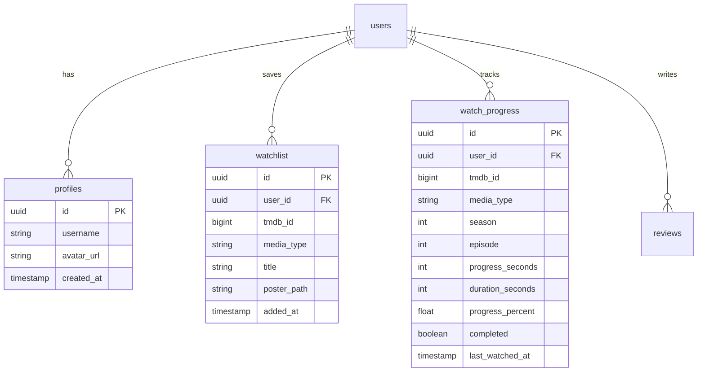

<div align="center">

# 🎬 Veyra

**A high-performance, modern movie & TV streaming application built with Next.js 16, Supabase, and TMDB.**

[](https://nextjs.org/)
[](https://www.typescriptlang.org/)
[](https://tailwindcss.com/)
[](https://supabase.com/)
[](LICENSE)

[Features](#-features) • [Tech Stack](#-tech-stack) • [Getting Started](#-getting-started) • [Database Schema](#-database-schema) • [Project Structure](#-project-structure)

</div>

---

## ✨ Features

- 🍿 **Curated Discovery & Hero Banner**: Live trending, popular, and top-rated content rails powered by the TMDB API.
- ⚡ **Seamless Playback & Progress Sync**: Integrated Video Player with automatic watch progress persistence (~10s debounce) to Supabase, enabling cross-device "Continue Watching".
- 📺 **Comprehensive TV Series Experience**: Detailed season accordions, episode selector grids, and smooth next/previous episode navigation.
- 🔖 **Personal Watchlist Library**: One-click watchlist toggle for saved movies and TV shows, guarded by Supabase Row Level Security (RLS).
- 🔍 **Instant Multi-Search**: Server-rendered multi-category search for movies, TV series, and actors with debounced query parameters.
- 🔐 **Authentication & User Profiles**: Complete auth flow (Sign up, Sign in, Sign out) with PostgreSQL triggers automatically creating user profile rows.
- 🎨 **Modern Dark Aesthetics**: Custom design system featuring Glassmorphism, smooth micro-animations (`framer-motion`), Google Fonts (`Space Grotesk` & `Manrope`), and skeleton loading placeholders.
- 🛡️ **Strict Security & Performance**: Server Components by default, server-only TMDB token isolation, Zod input validation schemas, and custom Content Security Policy (CSP) headers.

---

## 🛠️ Tech Stack

| Domain | Technology | Description |
|---|---|---|
| **Framework** | [Next.js 16](https://nextjs.org/) | App Router, Server Components, Turbopack, Middleware |
| **Language** | [TypeScript](https://www.typescriptlang.org/) | Strict mode, full type-safety from database to UI |
| **Styling** | [Tailwind CSS](https://tailwindcss.com/) | Custom design tokens, glassmorphism utilities, dark mode |
| **Backend & Auth** | [Supabase](https://supabase.com/) | SSR Client, PostgreSQL database, RLS policies, Auth triggers |
| **Data Provider** | [TMDB API](https://developer.themoviedb.org/) | Server-only cached client for metadata, images, and cast rails |
| **Animations** | [Motion](https://motion.dev/) | Smooth entrance animations and page transitions |
| **Validation** | [Zod](https://zod.dev/) | Runtime validation for API route payloads and player messages |

---

## 🚀 Getting Started

### Prerequisites

- **Node.js** 18.x or higher
- **npm**, **pnpm**, or **yarn**
- **TMDB API Key** (v4 Read Access Token from [TMDB Developer](https://developer.themoviedb.org))
- **Supabase Project** (Free-tier instance from [Supabase](https://supabase.com))

### 1. Clone the repository

```bash
git clone https://github.com/chittranshsharma/veyra.git
cd veyra
```

### 2. Install dependencies

```bash
npm install
```

### 3. Configure environment variables

Create a `.env.local` file in the root directory (refer to `.env.example`):

```env
NEXT_PUBLIC_APP_URL=http://localhost:3000

# TMDB Access Tokens
TMDB_API_KEY=your_tmdb_api_key
TMDB_READ_ACCESS_TOKEN=your_tmdb_read_access_token

# Supabase Credentials
NEXT_PUBLIC_SUPABASE_URL=https://your-project-ref.supabase.co
NEXT_PUBLIC_SUPABASE_ANON_KEY=your_supabase_anon_key
SUPABASE_SERVICE_ROLE_KEY=your_supabase_service_role_key
```

### 4. Setup Database Schema

Run the initial database migration script in your Supabase SQL Editor:

```bash
# Execute the SQL script in:
supabase/migrations/0001_init.sql
```

This creates the necessary `profiles`, `watchlist`, `watch_progress`, and `reviews` tables along with required Row Level Security (RLS) policies and user creation triggers.

### 5. Run the development server

```bash
npm run dev
```

Open [http://localhost:3000](http://localhost:3000) in your browser to view the app.

---

## 🗄️ Database Schema

Veyra uses Supabase (PostgreSQL) with strict RLS policies:



---

## 📁 Project Structure

```text
veyra/
├── app/                        # Next.js App Router routes
│   ├── (marketing)/            # Static legal & privacy pages
│   ├── api/                    # Serverless API routes (progress, watchlist, tmdb)
│   ├── auth/                   # Authentication routes (login, signup, callback)
│   ├── movie/[id]/             # Movie detail pages
│   ├── movies/                 # Dedicated movies catalog
│   ├── search/                 # Search page
│   ├── settings/               # User settings page
│   ├── tv/                     # TV series catalog & detail pages
│   ├── watch/                  # Video player routes (movies & TV series)
│   ├── watchlist/              # User watchlist page
│   ├── layout.tsx              # Root layout with Navbar & Footer
│   └── page.tsx                # Homepage featuring dynamic rails
├── components/                 # Reusable React components
│   ├── movie/                  # Poster cards, horizontal rails, trailer modals
│   ├── navigation/             # Navbar, MobileMenu drawer
│   ├── player/                 # Vidking video player integration
│   ├── search/                 # Debounced search bar
│   └── ui/                     # Badges, buttons, skeleton loaders, footer
├── lib/                        # Core utilities & clients
│   ├── supabase/               # Browser & SSR Supabase client instantiators
│   ├── tmdb/                   # Server-only TMDB API wrapper
│   └── validation/             # Zod input schemas
├── supabase/
│   └── migrations/             # SQL database migration files
├── types/                      # TypeScript database definitions
├── middleware.ts               # Supabase session refresh & route protection
├── next.config.ts              # Next.js configuration & CSP headers
└── tailwind.config.ts          # Custom design system tokens & colors
```

---

## 🛠️ Verification & Building

To verify type safety and build the application for production:

```bash
# Type-check TypeScript code
npx tsc --noEmit

# Build production bundle
npm run build

# Start production server
npm run start
```

---

## 📄 License

Distributed under the MIT License. See `LICENSE` for more information.

---

<div align="center">
  <sub>Built with Next.js, Supabase & TMDB. Designed for performance and visual excellence.</sub>
</div>
